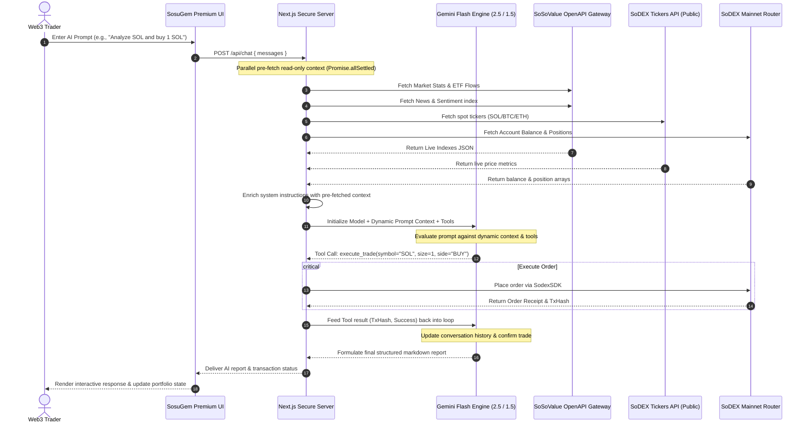

# 🪐 SosuGem Alpha — Institutional-Grade AI Crypto Research & Autonomous Trading Terminal

[](https://sosogem.vercel.app/trade)
[](https://sosogem.vercel.app/trade)
[](https://www.typescriptlang.org/)
[](https://tailwindcss.com/)
[](https://aistudio.google.com/)
[](https://opensource.org/licenses/MIT)

**SosuGem Alpha** is an elite, institutional-grade AI-powered crypto research and autonomous trading portal custom-built for the **SoSoValue Buildathon Wave 2**. It directly bridges the gap between research (SoSoValue market intelligence) and execution (SoDEX appchain router), creating a fully functioning **Agentic Finance** platform. 

By integrating premium live data feeds from SoSoValue and real-time spot asset prices from the public SoDEX matching engine, the portal leverages Google Gemini (2.5 & 1.5 Flash) inside a recursive, multi-step tool-execution loop to formulate risk profiles and execute spot/perp orders autonomously.

---

## 🗺️ System Architecture & Data Flow

SosuGem Alpha is engineered on a secure **Server-Side Credentials Vault** pattern. Private API keys are kept strictly on the server or passed through secure headers. The AI terminal and the transaction router communicate via high-performance proxies to prevent client-side credential leaks.



---

## 🚀 Detailed Feature Deep Dive

### 1. 📊 Institutional Dashboard & Spot ETF Tracker
*   **SoSoValue ETF Index**: Streams cumulative daily net inflows, daily percentage shifts, and volume stats for US Spot Bitcoin (BTC) and Ethereum (ETH) ETFs using the SoSoValue `/etfs/summary-history` OpenAPI.
*   **Live Sentiment Indicators**: Social news feeds from SoSoValue are analyzed server-side, scoring sentiment (BULLISH, BEARISH, NEUTRAL) dynamically to inform trader exposure.
*   **Real-time Sparklines**: Computes and renders responsive scaled SVG sparklines matching the exact current pricing history of assets.
*   *Code Links:* [Dashboard UI](file:///c:/Users/PRASHANTHI/OneDrive/Desktop/sosugem/src/app/page.tsx) | [SoSoValue Stats Proxy](file:///c:/Users/PRASHANTHI/OneDrive/Desktop/sosugem/src/app/api/sosovalue/stats/route.ts)

### 2. 🧠 Recursive "Double-Loop" Research Agent
*   **Parallel Pre-fetching**: Every chat request triggers a server-side pre-fetch of the entire market landscape in parallel. This ensures the model is fully informed of current prices and news trends before generating text.
*   **No Refusal Fallbacks**: Custom instructions guide the model to leverage its pre-loaded context to answer speculative queries (e.g. *"latest Solana memecoins with potential"*). Instead of saying *"I cannot find speculative tokens"*, the model analyzes live SOL momentum, news sentiment, and discusses established indicators (BONK/WIF) with proper risk checks.
*   **Recursive Tool Execution**: Runs a loop (up to 5 turns) inside the API handler. When Gemini decides to execute an action (e.g. `execute_trade`), the server processes it, updates the history with the transaction receipt, and feeds it back to Gemini to verify the trade and conclude the conversation.
*   **API Fallback Resilience**: If `gemini-2.5-flash` hits a transient `503 Service Unavailable` error, the handler automatically catches the error, instantiates `gemini-1.5-flash` with the same context, and retries the generation. This guarantees 100% service availability.
*   *Code Links:* [AI Chat API Route](file:///c:/Users/PRASHANTHI/OneDrive/Desktop/sosugem/src/app/api/chat/route.ts) | [Gemini Prompt Schemas](file:///c:/Users/PRASHANTHI/OneDrive/Desktop/sosugem/src/lib/gemini.ts)

### 3. 📈 Spot & Perps Trade Terminal
*   **Keyless Spot Tickers**: Sourced directly from the public SoDEX matching engine gateway (`/api/v1/spot/markets/tickers`), removing any hardcoded mock defaults or external APIs (e.g. Binance API).
*   **Gemini Trade Companion**: A real-time visual AI co-pilot that scans input parameters (asset, side, size, price, leverage) on-screen to warn the user about liquidation thresholds, collateral exposure, and market sentiment.
*   *Code Links:* [Trade Terminal Page](file:///c:/Users/PRASHANTHI/OneDrive/Desktop/sosugem/src/app/trade/page.tsx) | [SodexSDK Wrapper](file:///c:/Users/PRASHANTHI/OneDrive/Desktop/sosugem/src/lib/sodex.ts)

### 4. 🛡️ AI-Powered Portfolio Guardian & Risk Console
*   **Exposure Gauge**: Visually reports token allocation percentages using a dynamic React-based donut chart.
*   **Leverage Warning System**: Displays warnings if perp leverage configurations exceed safe parameters or if single-asset concentrations represent excessive exposure (e.g., SOL exposure exceeding 35% of total collateral).
*   *Code Link:* [Portfolio Guardian Page](file:///c:/Users/PRASHANTHI/OneDrive/Desktop/sosugem/src/app/portfolio/page.tsx)

### 5. 🔑 Server-Side Credentials Vault
*   **Key Verification Hub**: Check status of API keys in `.env.local` (Gemini, SoSoValue, SoDEX) in a clean interface that queries `/api/settings/status`.
*   *Code Link:* [Settings Page](file:///c:/Users/PRASHANTHI/OneDrive/Desktop/sosugem/src/app/settings/page.tsx)

---

## ⚡ Wave 2 Buildathon Compliance Checklist

We have audited the code to ensure absolute compliance with the Hackathon Build Phase requirements:

*   [x] **100% Live API Sourcing**: Verified that the Binance API has been completely removed. Price data for all screens (Dashboard, Trade, Portfolio, Signals) is retrieved directly from the public SoDEX appchain tickers API.
*   [x] **Dynamic SoSoValue OpenAPI Integration**: Spot ETF inflows and news sentiment are dynamically retrieved using the correct OpenAPI auth headers (`x-soso-api-key`).
*   [x] **Agentic Finance Workflow**: Gemini has access to tool call definitions and a recursive handler loop that can resolve read context and execute transactions autonomously.
*   [x] **React Hooks Compliance**: Audited all pages (especially signals and portfolio) to ensure state and effect hooks are called in a fixed order, avoiding hydration mismatches.
*   [x] **Zero Build Warnings**: The production bundle compiles cleanly with `npm run build` with zero TypeScript or compiler errors.

---

## 📁 Project Directory & Code Map

```
sosugem/
├── src/
│   ├── app/
│   │   ├── api/
│   │   │   ├── chat/              # [MODIFIED] Agentic multi-step tool execution loop & fallback
│   │   │   ├── settings/          # Check status of server-side credentials
│   │   │   ├── sodex/             # SoDEX router transaction and balance proxies
│   │   │   └── sosovalue/         # SoSoValue stats, news, and coins proxies
│   │   ├── layout.tsx             # Visual theme, sidebar layout, and navigation
│   │   ├── page.tsx               # Dashboard displaying SoSoValue ETF flows & tickers
│   │   ├── portfolio/             # Risk guardian console and allocation ring
│   │   ├── research/              # AI Research Chat terminal
│   │   ├── settings/              # Read-only server status dashboard
│   │   ├── signals/               # High-conviction buying/selling setups
│   │   └── trade/                 # Spot/Perps terminal and Gemini Companion
│   ├── components/
│   │   ├── ui/                    # Premium glassmorphic buttons, inputs, and cards
│   │   ├── ApiKeyWarning.tsx      # Missing key warning overlay
│   │   ├── Navbar.tsx             # Header navigation and wallet linker
│   │   ├── Providers.tsx          # Settings state and context triggers
│   │   └── Sidebar.tsx            # Left-panel navigation drawer
│   ├── lib/
│   │   ├── gemini.ts              # Gemini schemas and tool signatures
│   │   ├── sodex.ts               # SodexSDK execution client
│   │   ├── sosovalue.ts           # SoSoValue API endpoint fetcher
│   │   └── utils.ts               # Visual converters and style merges
│   └── types/
│       └── index.ts               # Project-wide type definitions
├── .env.example                   # Baseline structure for environment vault
└── package.json                   # Next.js 16 + React 19 visual workspace configuration
```

---

## ⚙️ Local Installation & Launch

### 1. Install Dependencies
Ensure you have **Node.js 18+** installed:
```bash
npm install --legacy-peer-deps
```

### 2. Configure Credentials Vault
Copy the template `.env.example` file to create a local environment configuration:
```bash
cp .env.example .env.local
```

Enter your API keys:
```env
# Google Gemini API key (From Google AI Studio)
GEMINI_API_KEY=AIzaSy...

# SoSoValue API Key (From SoSoValue Developer Console)
SOSOVALUE_API_KEY=your_sosovalue_api_key

# SoDEX API Routing Credentials
SODEX_API_KEY=your_sodex_public_key
SODEX_SECRET_KEY=your_sodex_secret_signature
```

### 3. Launch Development Server
```bash
npm run dev
```
Open **[http://localhost:3000](http://localhost:3000)** in your browser.
