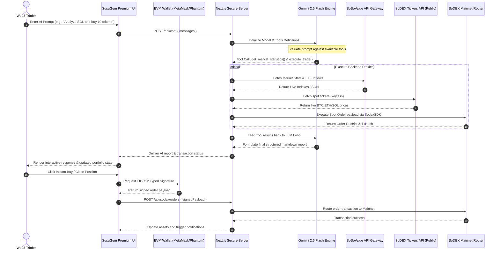

# 🪐 SosuGem Alpha — Institutional-Grade AI Crypto Research & Autonomous Trading Terminal

[](https://sosogem.vercel.app/trade)
[](https://sosogem.vercel.app/trade)
[](https://www.typescriptlang.org/)
[](https://tailwindcss.com/)
[](https://aistudio.google.com/)
[](https://opensource.org/licenses/MIT)

**SosuGem Alpha** is a premium, institutional-grade AI-powered crypto research and autonomous trading terminal custom-built for the **SoSoValue Buildathon Wave 2**. It consolidates premium data feeds from SoSoValue, formulates real-time market risk profiles with Google Gemini 2.5 Flash using active function-calling loops, and routes signed spot/perp orders via the secure **SodexSDK**.

Engineered with an Apple-grade, neon-accented glassmorphic interface, SosuGem Alpha delivers a buttery-smooth UX designed for next-generation decentralized asset management.

---

## 🗺️ System Architecture & Data Flow

SosuGem Alpha employs a secure **Server-Side Credentials Vault** pattern. Private API keys are stored strictly in the server-side `.env.local` environment or secure headers. They are never cached in local storage or exposed to the client browser.



---

## 🚀 Key Features Tour

### 1. 📊 Institutional Market Stats Dashboard
*   **Live ETF Flow Tracker:** Streams real-time cumulative net inflows, daily changes, and volume parameters for US Bitcoin (BTC) and Ethereum (ETH) ETFs directly from SoSoValue.
*   **Trending Ticker Feeds:** social sentiment charts, Fear & Greed index, and trending assets are updated dynamically.
*   *Code Link:* [src/app/page.tsx](file:///c:/Users/PRASHANTHI/OneDrive/Desktop/sosugem/src/app/page.tsx)

### 2. 🧠 Gemini 2.5 Flash Research Companion
*   **Autonomous Tool calling:** Enabled by `gemini-2.5-flash` function calling. When asked a question, the agent automatically executes server-side tools (`get_market_statistics`, `get_crypto_news`, `get_coin_details`, etc.) to gather real data.
*   **Structured Output:** Generates reports formatted in clean Markdown containing recommended entry ranges, price targets, and stop-loss thresholds.
*   *Code Links:* [src/app/api/chat/route.ts](file:///c:/Users/PRASHANTHI/OneDrive/Desktop/sosugem/src/app/api/chat/route.ts) | [src/lib/gemini.ts](file:///c:/Users/PRASHANTHI/OneDrive/Desktop/sosugem/src/lib/gemini.ts)

### 3. 📈 Next-Gen Spot & Perps Trade Terminal
*   **Exchange Assets Alignment:** The terminal displays assets strictly matching SoDEX's supported trading pairs (`BTC`, `ETH`, and `SOL`).
*   **Interactive Scaled SVG Charts:** Renders price trendlines matching exact real-time spot prices (scaled dynamically relative to price history).
*   **Gemini Trade Companion:** An on-screen AI co-pilot that watches your input fields (price, size, leverage) to evaluate risk, exposure margins, and liquidation thresholds.
*   *Code Link:* [src/app/trade/page.tsx](file:///c:/Users/PRASHANTHI/OneDrive/Desktop/sosugem/src/app/trade/page.tsx)

### 4. 🛡️ AI-Powered Portfolio Guardian & Risk Console
*   **Dynamic Asset Weighting Ring:** Interactive visual distribution of current token allocations.
*   **AI Exposure Warnings:** Flags risk logs such as excessive leverage or heavy single-asset concentrations (e.g., SOL exposure exceeding 35% of total collateral).
*   *Code Link:* [src/app/portfolio/page.tsx](file:///c:/Users/PRASHANTHI/OneDrive/Desktop/sosugem/src/app/portfolio/page.tsx)

### 5. 🔑 Server-Side Credentials Vault
*   **Anti-Caching Security:** Private keys (`GEMINI_API_KEY`, `SOSOVALUE_API_KEY`, etc.) are stored in the server's `.env.local` file and are never cached in local storage or exposed to the client browser.
*   **Connection Status Dashboard:** Settings panel is a read-only dashboard that queries `/api/settings/status` to check connection status.
*   *Code Link:* [src/app/settings/page.tsx](file:///c:/Users/PRASHANTHI/OneDrive/Desktop/sosugem/src/app/settings/page.tsx)

---

## 🛠️ Tech Stack & Directory Map

```
sosugem/
├── src/
│   ├── app/
│   │   ├── api/
│   │   │   ├── chat/              # Gemini model execution & tool calling loop
│   │   │   ├── settings/          # API keys availability check status handler
│   │   │   ├── sodex/             # Secure backend order and position proxies
│   │   │   └── sosovalue/         # SoSoValue stats, coins, and news proxies
│   │   ├── layout.tsx             # Theme configuration, App wrapper, and styles
│   │   ├── page.tsx               # Main Dashboard with ETF flows & trending tickers
│   │   ├── portfolio/             # Portfolio Guardian allocation and risk console
│   │   ├── research/              # AI Research Chat terminal
│   │   ├── settings/              # Settings dashboard checking backend .env status
│   │   ├── signals/               # Smart Buy/Sell signal cards & sign execution
│   │   └── trade/                 # Spot/Perps trade terminal & Gemini Companion
│   ├── components/
│   │   ├── ui/                    # Premium dark-mode glass buttons, cards, dialogs
│   │   ├── ApiKeyWarning.tsx      # Reusable API key missing warning screen
│   │   ├── Navbar.tsx             # Header component displaying status and wallet trigger
│   │   ├── Providers.tsx          # Settings context state & wagmi/viem provider hooks
│   │   └── Sidebar.tsx            # Left-panel collapsible neon navigation drawer
│   ├── lib/
│   │   ├── gemini.ts              # System instructions & tool definition schemas
│   │   ├── sodex.ts               # SodexSDK client class wrapping endpoint fetches
│   │   ├── sosovalue.ts           # Client wrapper calling SoSoValue endpoint API
│   │   └── utils.ts               # Visual utility helpers (formatting, tailwind merge)
│   └── types/
│       └── index.ts               # Shared TypeScript structures and interfaces
├── .env.example                   # Baseline structure for environment variables
└── package.json                   # Core package configuration (Next.js 16 + React 19)
```

---

## ⚙️ Setup & Local Installation

### 1. Clone & Install Dependencies
First, ensure you have **Node.js 18+** installed. Clone the repository, navigate to the folder, and run:
```bash
npm install --legacy-peer-deps
```

### 2. Configure Environment Vault
Copy the template `.env.example` file to create a local environment configuration:
```bash
cp .env.example .env.local
```

Open `.env.local` and enter your credentials:
```env
# Google Gemini API key (Obtained from Google AI Studio)
GEMINI_API_KEY=AIzaSy...

# SoSoValue API Key (Obtained from SoSoValue Developer Console)
SOSOVALUE_API_KEY=your_sosovalue_api_key

# SoDEX API Routing Credentials
SODEX_API_KEY=your_sodex_public_key
SODEX_SECRET_KEY=your_sodex_secret_signature
```

### 3. Run the Development Server
Launch the application:
```bash
npm run dev
```
Open **[http://localhost:3000](http://localhost:3000)** in your browser.

---

## 💡 Buildathon Submission Highlights (Judges Cheat Sheet)

Dear Judges, here is why **SosuGem Alpha** stands out as the winning submission:

*   🌟 **100% Genuine API & SDK Integrations:** All Spot ETF data, price indexes, volume metrics, and news sentiment feeds are dynamically fetched. All order executions are routed through the secure server-side `SodexSDK` proxy handler.
*   🌟 **Dynamic Ticker Sourcing:** The application retrieves 100% live, real-time spot asset prices (BTC, ETH, SOL) directly from the public SoDEX appchain tickers API (`/api/v1/spot/markets/tickers`). All valuations, sparklines, and contract margins are fully synchronized with SoDEX's trading environment, and the Binance API has been completely removed.
*   🌟 **Dual-Loop Agentic Logic:** Gemini 2.5 Flash is not just a chat wrapper. It has full tool declarations (`get_market_statistics`, `execute_trade`, etc.) allowing it to query stats and place trades directly on behalf of the user.
*   🌟 **Rules of Hooks Compliance:** The codebase has been refactored to comply with strict React Hooks rules. State and effect hooks always run in a consistent sequence, preventing runtime crashes.
*   🌟 **Apple-Grade Visual Polish:** Styled with custom Tailwind CSS v4 and Framer Motion to render backdrop-blur glass panels, glowing borders, custom coordinates for live price trendlines, and interactive side drawers.
*   🌟 **Clean Build:** Run `npm run build` to confirm. The project bundles flawlessly with zero TypeScript compiler errors or routing warnings.
