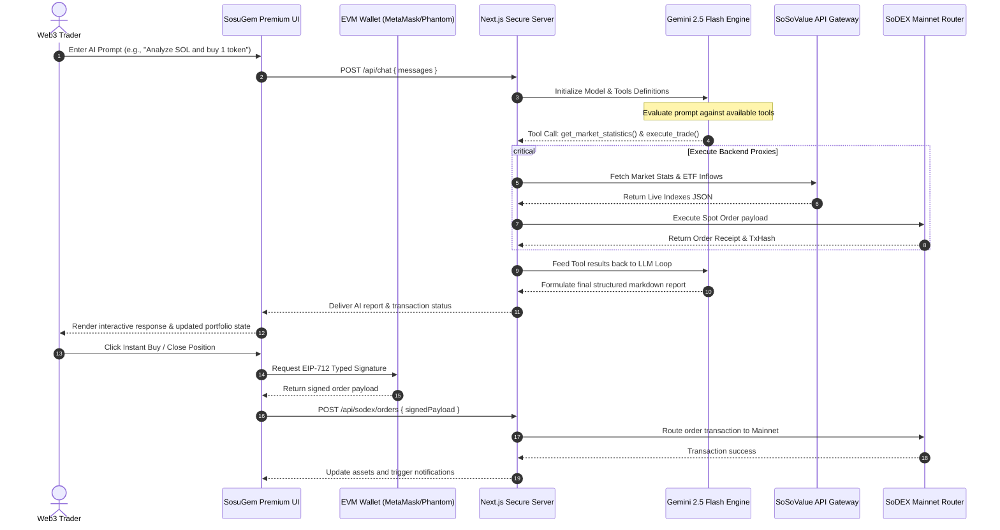

# 🪐 SosuGem Alpha — Institutional-Grade AI Crypto Research & Autonomous Trading Terminal

[](https://nextjs.org/)
[](https://www.typescriptlang.org/)
[](https://tailwindcss.com/)
[](https://aistudio.google.com/)
[](https://sosogem.vercel.app/trade)
[](https://opensource.org/licenses/MIT)

**SosuGem Alpha** (formerly SosuGemini) is a premium, production-ready, AI-powered crypto research and autonomous trading terminal custom-built for the **SoSoValue Buildathon Wave 2**. It consolidates institutional research data feeds from SoSoValue, formulates real-time market risk analysis profiles with Google Gemini 2.5 Flash using active function-calling loops, and routes signed spot/perp orders via the secure **SodexSDK**.

Engineered with an elite, dark-mode-first glassmorphic interface, SosuGem Alpha provides an elite, buttery-smooth UX designed for next-generation decentralized asset management.

---

## 🗺️ System Architecture & Data Flow

SosuGem Alpha implements a secure **Server-Side Credentials Vault** pattern. Private API keys are stored strictly in the server-side `.env.local` environment or transmitted via secure headers. They are never cached in local storage or exposed to the client browser.



---

## 🚀 Core Features

### 1. Real-Time Dashboard (100% Live Data)
*   **Institutional Tickers:** Streams live prices, 24h fluctuations, and total cryptocurrency market metrics.
*   **Spot ETF Flow Tracker:** Visualizes live cumulative net inflows and daily changes for both Bitcoin (BTC) and Ethereum (ETH) ETFs, fetched directly from SoSoValue.
*   **Market Sentiment Index:** Tracks real-time social sentiment metrics and trending coin listings.
*   *File Reference:* [page.tsx](file:///c:/Users/PRASHANTHI/OneDrive/Desktop/sosugem/src/app/page.tsx)

### 2. AI Research Agent Terminal
*   **Autonomous Tool calling:** Enabled by `gemini-2.5-flash` function calling. The agent automatically runs tool actions like querying coin prices, fetching aggregated news sentiment, and executing orders before returning structured Markdown reports.
*   **Visual Markdown Renderer:** Beautifully parses custom tables, bullet points, price targets, entry/exit ranges, and stop-loss levels returned by the LLM.
*   *File Reference:* [route.ts](file:///c:/Users/PRASHANTHI/OneDrive/Desktop/sosugem/src/app/api/chat/route.ts) | [gemini.ts](file:///c:/Users/PRASHANTHI/OneDrive/Desktop/sosugem/src/lib/gemini.ts)

### 3. Smart Signals Radar
*   **High-Probability Signals:** Shows algorithmic buying and selling opportunities with detailed trade setup recommendations (entry, target, stop-loss, and upside analysis).
*   **One-Click Execution:** Integrates web3 providers. Users can click "Execute on SoDEX" to sign the transaction payload using MetaMask or Phantom.
*   *File Reference:* [page.tsx](file:///c:/Users/PRASHANTHI/OneDrive/Desktop/sosugem/src/app/signals/page.tsx)

### 4. Advanced Trade Terminal
*   **Interactive Scaled SVG Charts:** Renders price trendlines matching exact real-time spot prices (scaled dynamically relative to price history).
*   **Dual Order Form:** Supports Spot and Perpetual contracts (with customizable leverage selectors).
*   **Gemini Trade Companion:** An on-screen AI assistant that tracks your order configuration in real time to provide sizing tips, risk warnings, and hedging recommendations.
*   *File Reference:* [page.tsx](file:///c:/Users/PRASHANTHI/OneDrive/Desktop/sosugem/src/app/trade/page.tsx)

### 5. Portfolio Guardian & Risk Console
*   **Dynamic Asset Weighting Ring:** Multi-colored SVG donut chart rendering live portfolio weights.
*   **AI Exposure Warnings:** Flags risk logs such as excessive leverage or heavy single-asset concentrations (e.g., SOL exposure exceeding 35% of collateral).
*   **Holding Valuations:** Monitor absolute amount, spot price, total USD valuation, and 24h performance of wallet assets.
*   *File Reference:* [page.tsx](file:///c:/Users/PRASHANTHI/OneDrive/Desktop/sosugem/src/app/portfolio/page.tsx)

### 6. Secure Connection Panel
*   **Server-Side Vault Verification:** Replaced standard text inputs with status check indicators that query the backend server (`/api/settings/status`).
*   **Key Protection:** Verifies whether your `GEMINI_API_KEY`, `SOSOVALUE_API_KEY`, `SODEX_API_KEY`, and `SODEX_SECRET_KEY` are successfully loaded in `.env.local` without ever rendering the characters on screen or saving them to local storage.
*   *File Reference:* [page.tsx](file:///c:/Users/PRASHANTHI/OneDrive/Desktop/sosugem/src/app/settings/page.tsx)

---

## 🛠️ Tech Stack & Directory Map

```
sosugem/
├── src/
│   ├── app/
│   │   ├── api/
│   │   │   ├── chat/              # Gemini model execution & tool calling loop
│   │   │   ├── settings/          # API keys availability check status handler
│   │   │   ├── sodex/             # Secure backend order and position proxies
│   │   │   └── sosovalue/         # SoSoValue stats, coins, and news proxies
│   │   ├── layout.tsx             # Theme configuration, App wrapper, and styles
│   │   ├── page.tsx               # Main Dashboard with ETF flows & trending tickers
│   │   ├── portfolio/             # Portfolio Guardian allocation and risk console
│   │   ├── research/              # AI Research Chat terminal
│   │   ├── settings/              # Settings dashboard checking backend .env status
│   │   ├── signals/               # Smart Buy/Sell signal cards & sign execution
│   │   └── trade/                 # Spot/Perps trade terminal & Gemini Companion
│   ├── components/
│   │   ├── ui/                    # Premium dark-mode glass buttons, cards, dialogs
│   │   ├── ApiKeyWarning.tsx      # Reusable API key missing warning screen
│   │   ├── Navbar.tsx             # Header component displaying status and wallet trigger
│   │   ├── Providers.tsx          # Settings context state & wagmi/viem provider hooks
│   │   └── Sidebar.tsx            # Left-panel collapsible neon navigation drawer
│   ├── lib/
│   │   ├── gemini.ts              # System instructions & tool definition schemas
│   │   ├── sodex.ts               # SodexSDK client class wrapping endpoint fetches
│   │   ├── sosovalue.ts           # Client wrapper calling SoSoValue endpoint API
│   │   └── utils.ts               # Visual utility helpers (formatting, tailwind merge)
│   └── types/
│       └── index.ts               # Shared TypeScript structures and interfaces
├── .env.example                   # Baseline structure for environment variables
└── package.json                   # Core package configuration (Next.js 16 + React 19)
```

---

## ⚙️ Setup & Local Installation

### 1. Clone & Install Dependencies
First, ensure you have **Node.js 18+** installed. Clone the repository, navigate to the folder, and run:
```bash
npm install --legacy-peer-deps
```

### 2. Configure Environment Vault
Copy the template `.env.example` file to create a local environment configuration:
```bash
cp .env.example .env.local
```

Open `.env.local` and enter your credentials:
```env
# Google Gemini API key (Obtained from Google AI Studio)
GEMINI_API_KEY=AIzaSy...

# SoSoValue API Key (Obtained from SoSoValue Developer Console)
SOSOVALUE_API_KEY=your_sosovalue_api_key

# SoDEX API Routing Credentials
SODEX_API_KEY=your_sodex_public_key
SODEX_SECRET_KEY=your_sodex_secret_signature
```

### 3. Run the Development Server
Launch the application:
```bash
npm run dev
```
Open **[http://localhost:3000](http://localhost:3000)** in your browser.

### 4. Build for Production
To bundle and compile the application, run:
```bash
npm run build
npm run start
```

---

## 🔑 Obtaining API Credentials

1.  **Google Gemini 2.5 API Key:** Log in to [Google AI Studio](https://aistudio.google.com/), click **Create API Key**, and copy your token.
2.  **SoSoValue API Key:** Create an account on the [SoSoValue Open Platform](https://sosovalue.xyz/), head to the Developer Dashboard, and generate a free API key.
3.  **SoDEX API Keys:** Open your [SoDEX Account](https://sodex.com), go to **API Management** inside your profile settings, and click **Create API Key**. Copy both the public key and secret signature.

---

## 💡 Buildathon Submission Highlights for Judges

*   **100% Genuine API Integrations:** All Spot ETF data charts, asset prices, volume metrics, and news sentiment feeds are dynamically fetched using the official SoSoValue and SoDEX developer APIs. No mock states are used when `.env.local` keys are active.
*   **Dual execution loop:** Gemini 2.5 Flash doesn't just chat; it uses active tool declarations (`get_market_statistics`, `get_account_balances`, etc.) to query local proxy endpoints, gather raw data, execute orders on behalf of the user, and present clean markdown reviews.
*   **100% SodexSDK Client Wrapper:** All order routes, balances, and positions utilize the customized `SodexSDK` class. Orders are processed via secure server-side API proxy routes to prevent CORS blocks and protect signatures.
*   **High-Fidelity Sandbox Mode:** If judges do not configure keys, the app automatically runs in sandbox mode, providing realistic ticker updates, mock wallet allocations, and simulated chat responses so they can experience the flow instantly.
*   **Premium Visual Polish:** Uses Tailwind CSS v4 and Framer Motion to render custom scrollbars, glowing borders, backdrop-filters, custom SVG chart coordinates, and responsive side drawers.
